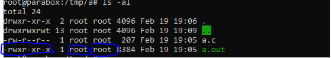

# Fundamental Commands 

- `su` is a command that allows you to change the user, without logging out and logging back in again.

- `>` is the operator for output redirection. Meaning that you can redirect the output of any command to a file.

- `>>` does mainly the same thing as `>`, with one key difference. `>>` appends the output of a command to a file, instead of erasing it.

- `&&` means as you might expect "and". Meaning `&&` allows you to execute a second command after the first one has executed successfully.

- `&` is a background operator, meaning say you run a command in background

- `$` is used to denote environment variables.
    - just running  `export <varname>=<value>` will set that as an environment variable

- `|` The pipe is unique because while operators like `>>` allow you to store the output of a command, the `|` operator allows you to take the output of a command and use it as input for a second command.

- These attributes are(in order) the file permissions, owner of the file, and group that the file is in.


- `chmod` allows you to set the different permissions for a file, and control who can read it. 
    - The syntax of this command is typically 
    `chmod <file> <permissions>`
    `chmod file 765`
    the first digit controls the permissions for a user, the second digit controls the permission for a group, the third digit controls permissions for everyone

- `chown` allows us to change the user and group for any file.
`chown user:group file`

- `ln`
    - *hard linking,* which completely duplicates the file.Meaning What ever is done to the created link, is also done to the original file.
    `ln source destination` 
    - *symbolic linking,* while a hard linked file contains the data in the original file, a symbolic link is just a glorified reference.
    `ln -s file destination`

- `find` it finds files. if you ran `find /tmp` it would list every file in `/tmp`. 
    - it is recursive, so it searches every directory that is in the original directory
    - it can only list files in directories that you have permission to access

    ```
    Find files that end in .conf in the current directory (and all subdirs).
    find . -name "*.conf"
    
    Find files of type file (not directory, pipe or etc.) that end in .conf.
    find . -type f -name "*.conf"
    
    Find can also execute another command on every file found. This example will look for *.odf files and copy them to /backup/.
    find /data -name "*.odf" -exec cp {} /backup/ \;
    ```

- `grep` It allows you find data inside of data.
`grep <string> <file>` however file is optional if you're using piping.

- `adduser` and `addgroup`
*syntax:* `adduser username` and `addgroup groupname` 
*add a user to a group:* `usermod -a -G <groups seperated by commas> <user>`